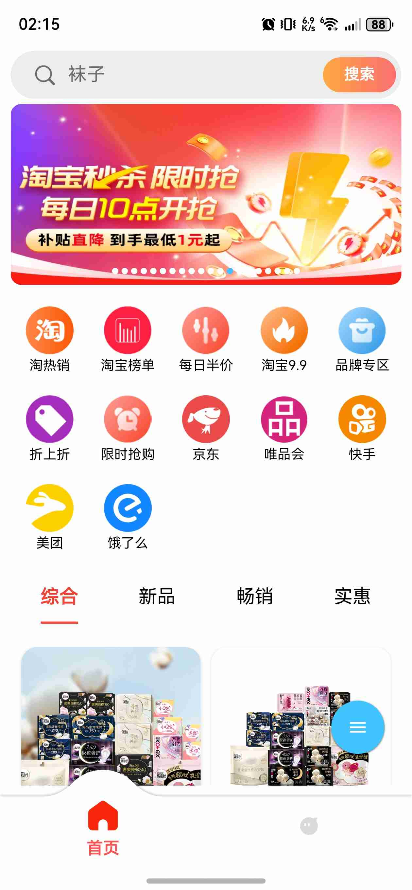
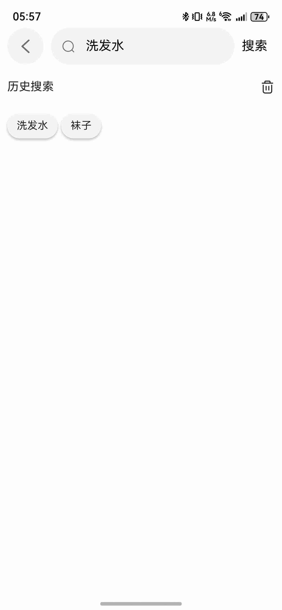
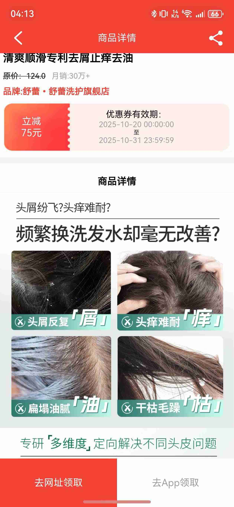
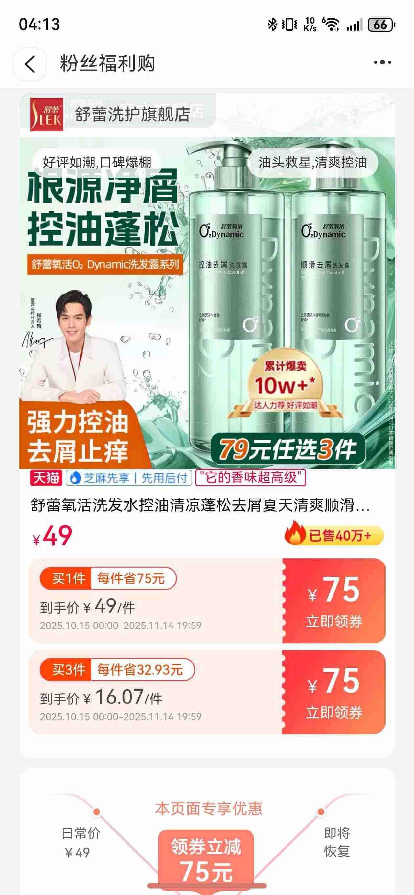
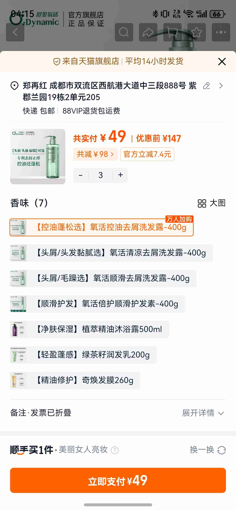
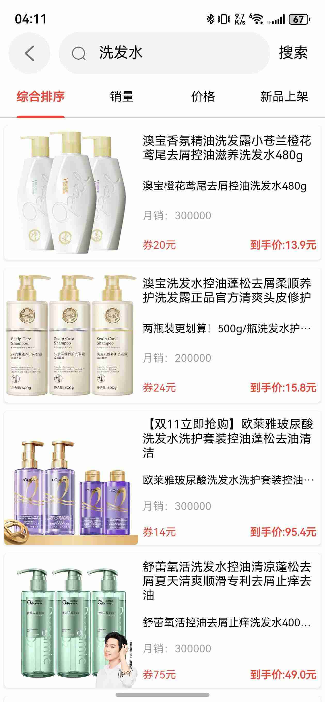
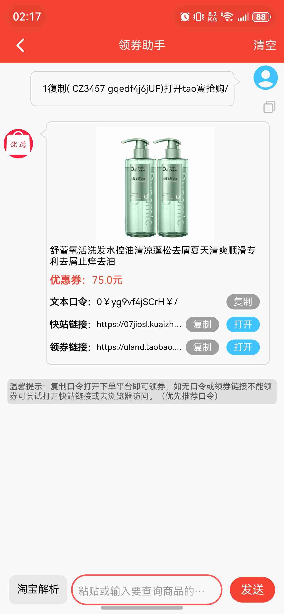
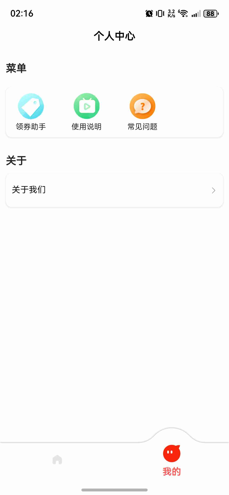

# 🎁 全网优惠券聚合 App

> 一键领取淘宝、京东、唯品会、美团、饿了么、快手等主流平台优惠券
> 
> **无需登录 · 完全免费 · 永久使用**

<div align="center">


[](app/app1.3.0.apk)
[](app/HarmonyOS系统版本下载地址-华为应用市场.txt)
[](app/app1.3.0.apk)
[](#)

</div>

---

## ✨ 核心特性

### 🎯 六大平台全覆盖
- **淘宝** - 海量商品优惠券，每日更新
- **京东** - 品质好物，专享折扣
- **唯品会** - 品牌特卖，额外优惠
- **美团** - 外卖、团购、酒店优惠
- **饿了么** - 外卖红包，天天领
- **快手** - 直播好物，超值优惠

### 💎 三大核心优势

| 特性 | 说明 |
|------|------|
| 🚀 **无需登录** | 打开即用，无需注册账号 |
| 💰 **完全免费** | 永久免费，无任何收费项目 |
| 🔒 **隐私安全** | 不收集个人信息，放心使用 |

---

## 📱 应用截图

<div align="center">

   

   

</div>

---

## 📥 下载安装

### 🏪 应用商店下载（推荐）

已上架以下应用商店，搜索"**优惠券**"或"**全网优惠券**"即可找到：

<div align="center">

| 应用商店 | 状态 | 搜索关键词 |
|---------|------|-----------|
| 🟠 **华为应用市场** | ✅ 已上架 | 优惠券 / 全网优惠券 |
| 🔵 **荣耀应用市场** | ✅ 已上架 | 优惠券 / 全网优惠券 |
| 🟣 **vivo 应用商店** | ✅ 已上架 | 优惠券 / 全网优惠券 |
| 🟠 **小米应用商店** | ✅ 已上架 | 优惠券 / 全网优惠券 |
| 🔴 **联想应用商店** | ✅ 已上架 | 优惠券 / 全网优惠券 |
| 🔵 **百度手机助手** | ✅ 已上架 | 优惠券 / 全网优惠券 |
| 🟢 **豌豆荚** | ✅ 已上架 | 优惠券 / 全网优惠券 |

</div>

**推荐理由：**
- ✅ 官方渠道，安全可靠
- ✅ 自动更新，及时获取新版本
- ✅ 无需额外权限设置

---

### 📦 APK 直接下载

如果你的设备无法访问上述应用商店，可以直接下载 APK 安装包：

```
📦 app/app1.3.0.apk
```

**安装步骤：**
1. 下载 `app1.3.0.apk` 文件
2. 允许"安装未知来源应用"权限（仅首次需要）
3. 点击安装包完成安装
4. 打开应用即可使用

---

### 🌸 HarmonyOS 系统

**华为应用市场下载：**

查看下载地址文件：
```
📄 app/HarmonyOS系统版本下载地址-华为应用市场.txt
```

或直接在华为应用市场搜索"**优惠券**"

---

## 🎯 使用场景

### 日常购物省钱
- 网购前先领券，每单都省钱
- 支持商品搜索，快速找到优惠

### 外卖点餐优惠
- 美团、饿了么红包天天领
- 下单前领券，立减配送费

### 品牌特卖抢购
- 唯品会品牌特卖优惠券
- 京东品质好物专享折扣

### 直播购物优惠
- 快手直播间专属优惠
- 主播推荐商品额外折扣

---

## 🌟 为什么选择我们？

### ✅ 真正的省钱神器
- 聚合六大主流平台优惠券
- 每日更新，优惠不断
- 一个 App 搞定所有平台

### ✅ 极简使用体验
- 无需注册登录，打开即用
- 界面简洁，操作流畅
- 搜索便捷，快速找券

### ✅ 安全可靠
- 不收集个人信息
- 不需要任何权限
- 完全免费，无广告骚扰

---

## 🔧 系统要求

| 系统 | 最低版本 |
|------|----------|
| Android | 5.0 及以上 |
| HarmonyOS | 6.0 及以上 |

---

## 📊 版本信息

**当前版本：** v1.3.0

### 更新内容
- ✨ 支持六大主流电商平台
- 🚀 优化应用性能和加载速度
- 🎨 全新 UI 设计，使用更流畅
- 🔧 修复已知问题，提升稳定性

---

## ❓ 常见问题

<details>
<summary><b>Q: 推荐哪种下载方式？</b></summary>

A: 推荐通过应用商店下载，更安全便捷且支持自动更新。如果你的设备品牌对应的应用商店已上架，优先选择应用商店下载。
</details>

<details>
<summary><b>Q: 为什么 APK 安装需要"未知来源"权限？</b></summary>

A: 这是 Android 系统的安全机制。如果通过应用商店下载则无需此权限。直接安装 APK 时需要开启，安装完成后可以关闭。
</details>

<details>
<summary><b>Q: 应用真的完全免费吗？</b></summary>

A: 是的，本应用永久免费使用，无任何内购项目，无广告，无需付费解锁功能。
</details>

<details>
<summary><b>Q: 为什么不需要登录？</b></summary>

A: 为了保护用户隐私，本应用采用无账号设计，所有功能无需登录即可使用。
</details>

<details>
<summary><b>Q: 优惠券是真实有效的吗？</b></summary>

A: 所有优惠券均来自各平台官方渠道，真实有效。领取后跳转到对应平台使用即可。
</details>

<details>
<summary><b>Q: 支持哪些平台？</b></summary>

A: 目前支持淘宝、京东、唯品会、美团、饿了么、快手六大主流平台，后续会持续增加更多平台。
</details>

---

## 📞 联系与反馈

如有问题或建议，欢迎通过以下方式联系：

- 📧 提交 Issue
- 💬 在 Discussions 中讨论
- ⭐ 觉得好用请给个 Star

---

## 📄 免责声明

本应用仅作为优惠信息聚合工具，所有优惠券信息均来自各电商平台公开渠道。用户使用优惠券时需遵守各平台的使用规则。本应用不对优惠券的有效性、商品质量等承担责任。

---

## 🎉 开始使用

1. **下载应用** - 优先选择应用商店下载（华为/荣耀/vivo/小米/联想/百度/豌豆荚）
2. **安装应用** - 应用商店一键安装，或手动安装 APK
3. **打开应用** - 无需登录，立即开始省钱
4. **领取优惠** - 浏览、搜索、领券，享受优惠

---

<div align="center">

**💰 省钱从现在开始，每一单都有优惠！**

Made with ❤️ for smart shoppers

</div>
